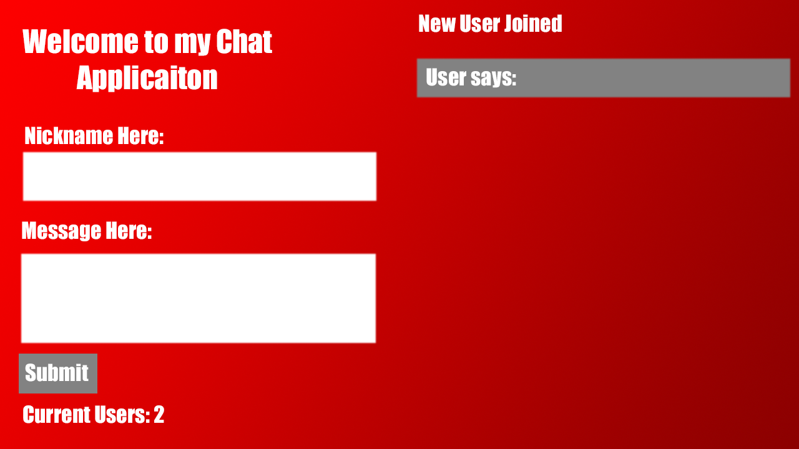

# Chat Application using Node, NPM and Socket.io

Used Node and Express to generate the server app; used Vue as template / view
engine client.

## Notes about the project

`node app` is required to use this app

Preview of Site

## Applications used during development

- socket.io
- Vue.js
- SASS
- Node.js / Express.js
- https://expressjs.com/
